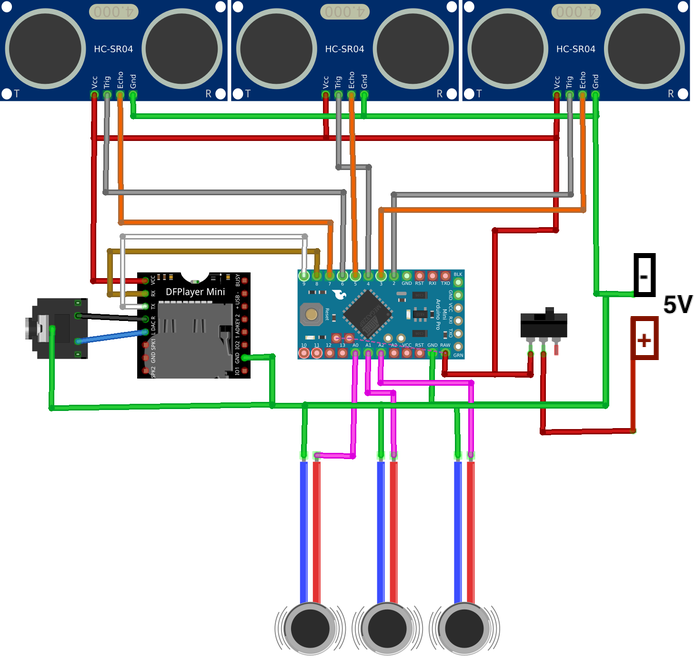

# Smart Glass for Blind Person Using Arduino and Ultrasonic Sensor 👓🔊

An assistive smart glass system designed to help visually impaired people detect obstacles in their path using ultrasonic sensors and Arduino. The system alerts the user through buzzer sounds and LED indications, enabling safer navigation.

---

## 🌟 Project Overview

This project uses an **Arduino** and an **HC-SR04 ultrasonic sensor** mounted on glasses to detect obstacles in front of the user. When an obstacle is detected within a predefined distance, the system triggers a buzzer and LED to alert the wearer, helping them avoid collisions.

---

## 🛠️ Components Required

- Arduino 
- HC-SR04 Ultrasonic Sensor  
- Buzzer  
- LED (with 220Ω resistor)  
- Jumper wires  
- Power supply 
- Glass frame or holder for mounting sensor and electronics  

---

## 🔌 Circuit Diagram

**Description:**  
- Ultrasonic sensor’s VCC and GND connected to Arduino 5V and GND  
- Trigger pin connected to Arduino digital pin 9  
- Echo pin connected to Arduino digital pin 10  
- Buzzer connected to Arduino digital pin 11  
- LED connected to Arduino digital pin 13 via 220Ω resistor  

---

## ⚙️ Algorithm

1. Initialize pins for ultrasonic sensor, buzzer, and LED.  
2. Continuously send trigger pulses to the ultrasonic sensor.  
3. Measure the echo pulse duration to calculate distance.  
4. If the measured distance is less than or equal to a safety threshold (e.g., 5 cm):  
   - Turn ON buzzer and LED to alert the user.  
5. Else:  
   - Turn OFF buzzer and LED.  
6. Repeat the process continuously to provide real-time obstacle detection.  

---

## 🎯 Benefits

- Provides real-time obstacle detection at face level  
- Alerts visually impaired users via sound and light signals  
- Hands-free and easy to wear  
- Simple, low-cost, and effective assistive technology  

---

## 📸 Project Images

  
  
  

---

---

Made with ❤️ to empower the visually impaired! 👓✨

---
